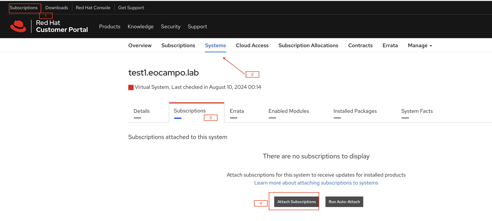

# Capacitación Ansible

## Sesiones realizadas

| Fecha | Tema |
|:----- |:-----|
|05/ago/24 20:00 - 22:00 | Intrducción a Ansible, Instalación y relación de confianza |
|08/ago/24 20:00 - 21:00 | Command Line (ansible ad-hoc), invenatrio básico |
|09/ago/24 20:00 - 21:00 | Diferencias entre algunos módulos, creación primar playbook |


## Conceptos

| Termino | Descripción |
|:----- |:-----|
| ansible | Automatización de código abierto |
| cml ad-hoc | línea de comandos básicos |
| ansible-core | librería que contiene los paquetes necesarios (como python) para la ejecución de código |
| ansible AWX | versión open source de la versión Anisble Tower |
| Ansible Automation Platform | Software open source de Red Hat que contiene componentes adicionales a la versión AWX |
| playbook | conjunto de tareas utilizando modulos ansible |
| collections | conjunto de playbook desarrollados por la comunidad que ayudan a la ejecución de tareas en un playbook |
| roles | unión de varios playbook's y otros archivos de de apoyo a la ejecución de los mismos |
| YAML/YML | lenguaje de formato standard y de representación de datos estructurados |
| inventarios | fuente de origen de hosts destino |

## Primeros pasos

### Servidor de Ansible

Se requiere una máquina con sistema RHEL 8.6 o superior. Para obtenerla se puede suscripcbir a Red Hat developer [developers.redhat.com](https://developers.redhat.com/) para obtener 10 suscripciones de SO RHEL con una vigencia de 1 año y las cuales se pueden renovar al siguiente año. No tienen soporte. Anisble no está soportado para instalarse sobre Windows.

Una ves se tiene el login anterior, se puede descargar la imagen ISO [access.redhat.com](https://access.cdn.redhat.com/content/origin/files/sha256/39/398561d7b66f1a4bf23664f4aa8f2cfbb3641aa2f01a320068e86bd1fc0e9076/rhel-9.4-x86_64-dvd.iso?user=a6756d7dea19200a6b3d3ceccb01836b&_auth_=1722924666_110a9310f42357463d661f9d170a52e5)

#### Procedimientos iniciales en el servidor para Ansible

 - Instalción básica de SO, con sepra ciones de filesystem basadas en LVM (con excepción del boot y se suguiere un /home de 20GB independiente). Tener al meno 4Gb de RAM y 2 CPU.

*Particionamiento sugerido*

```
boot          500 Mb
/             20  Gb
/home         20  Gb
/tmp          5   Gb
/var          10  Gb
/var/log      5   Gb
/tmp          5   Gb
```

 - **Atachar una subscripción**, se utiliza el usuario de redhat developer y la contraseña asignada

```
susubscription-manager register --username user
```

 - **Asignar la suscripción**. Este proceso se debe realizar desde el [portal de red hat en la sección de suscripciones](https://access.redhat.com/management/subscriptions). Allí se debe selecionar el systema que anteriormente se registró (validar que el hostname de la máquina sea el correcto, de lo contrario corregirlo y repetir el proceso de suscripción). Una ves se seleccione se se le atacha la suscripción de de RHEL disponible

     

***Nota de buena práctica*** 

  **Crear un usuario en la máquina de anisble con privilegios de sudo a root sin password. Este usuario tambien se recomienda estar creado en los sistemas remotos linux a los que se va a llegar.** Las líneas a continuación resumen cómo crear el usuario

```
root@hostname ~ % useradd username
root@hostname ~ % su - username
root@hostname ~ % exit
root@hostname ~ % touch //etc/sudoers.d/username
root@hostname ~ % visudo /etc/sudoers.d/eocampo
                  %username	ALL=(ALL)	NOPASSWD:ALL
```


 - **Instalación de ansible-core**. En este proceso se realiza la instalación de ansible, como se ve a continuación:

```
dnf install ansible-core
```

 - **Generar relación de confianza localmente**. Estando en la máquina de ansible, se asegura la relación de confianza consigo mismo. Primero generar la llave privada y pública del usuario y luego se estable la relación de confianza.

```
ssh-keygen  ## generar la llave
ssh-copy-id username@hostname_local ## relación de confianza local
```

***Nota de buena práctica*** 

  **Utilizar el fqdn completo de la máquina. Si no se cuenta con DNS se debe registrar la IP con el hostname del fqdn completo en /etc/hosts**


## Invenatarios

La siguiente es la estructura de un inventario para ansible. NOTA: no lleva extensión.

```
estoesunaprueba ansible_host=192.168.241.130
test2.eocampo.lab
test3.eocampo.lab

[apache]
estoesunaprueba
test3.eocampo.lab

[so]
estoesunaprueba
test3.eocampo.lab
test2.eocampo.lab

[db]
test3.eocampo.lab
test2.eocampo.lab

[erp:children]
apache
db
```
***Nota de buena práctica*** 

  **Se pueden agregar variables a cada hosts, como en el ejemplo exista la variable que determina la IP del host. También se pueden hacer grupos y subgrupos** [doc ansible inventory](https://docs.ansible.com/ansible/latest/getting_started/get_started_inventory.html)

## Ansible ad-hoc (command line)

### Estructura general cml

```
ansible -i {ruta del inventario} -m {comando Ansible} -a '{parámetros de so o de ansible}' {máquina o grupo} [--become] (become si requiere ejeuctar como root)
```

### Ejemplos con módulos:

```
# shell
ansible -i inventory -m shell -a 'cat /etc/fstab' prdrhel
ansible -i inventory -m shell -a 'ls -la /tmp/javasharedresources' prdrhel
ansible -i inventory -m shell -a 'chmod o-w /data' prdal 
ansible -i inventory -m shell -a 'touch /data/prueba' prdal 
ansible -i inventory -m shell -a 'rm -rf /data/prueba' prdal 

# lineinfile
ansible -i inventory -m lineinfile -a 'path={ruta} line="{expresión o línea}" create=yes'
ansible -i inventory -m lineinfile -a 'path={ruta} line="{expresión o línea}" state=absent'

# yum
ansible -i inventory -m yum -a 'name="telnet" state=present' drrhel --become
ansible -i inventory -m yum -a 'name="telnet" state=absent' drrhel --become
ansible -i inventory -m yum -a 'name=tlenet state=list' WUE1ATPSPFIMAP1 --become
ansible -i inventory -m yum -a 'name=rsync state=absent' WUE1ATPSPFIMAP1 --become

# file

ansible -i inventory -m file -a 'path=/etc/cron.allow state=touch mode=600' secrhel --become

# copy
ansible -i inventory -m copy -a 'src=/home/provseti/all_logs.sh dest=/tmp/all_logs.sh owner=root group=root mode=640' guaral --become

# blockinfile
ansible -i inventory -m blockinfile -a 'path={ruta} block="| prueba "'

# cron
ansible -i inventory -m cron -a 'name="Integrity FS" minute="0" hour="5" user=root job="/usr/bin/aide.wrapper --config /etc/aide/aide.conf --check"' localhost

#### user
ansible -i inventory.yml -m user -a 'name=provseti groups=adminso' prdrhel

#### ansible.builtin.group
ansible -i inventory.yml -m ansible.builtin.group -a 'name=adminso state=present' drrhel
```

## Playbooks

### Mi primer playbook

       ---
       - name: Mi primer playbook
         hosts: all
         gather_facts: false
         become: yes
       
         tasks:
       
         - name: Instalar Httpd
           ansible.builtin.dnf:
             name: httpd
             state: latest
       
         - name: Validar si el firewall está arriba
           ansible.builtin.service:
             name: firewalld
             state: started
           register: firewalld_status
       
         - name: Restart firewalld if not running
           ansible.builtin.service:
             name: firewalld
             state: restarted
           when: not firewalld_status.status.ActiveState == "active"
